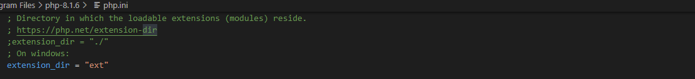
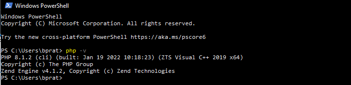
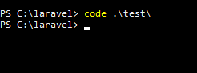

<!--  -->

## Install PHP

Download dan Extract file untuk instalasi PHP

File dapat di download di sini https://www.php.net/downloads.php

Copy di lokasi `C:\Program Files` Pada file `php.ini development` copy dan ubah menjadi `php.ini` buka dengan text editor dan ubah beberapa line seperti di bawah, lalu simpan

Buka `Edit The System Environment Variables` klik Environment Variables

Pilih variabel path untuk menambahkan alamat dari file php, kemudian pilih ok.

Pada `System variables` pilih `Path` tambahkan alamat dari file PHP, kemudian ok

Buka Terminal dan gunakan `php –v` untuk mengecek sudah terinstall atau belum

<!--  -->

## Install Composer

Download dan Install Composer https://getcomposer.org/download/

<!-- Revisi disini -->

<!-- Revisi disini -->

Buka Terminal dan gunakan `composer` untuk mengecek sudah terinstall atau belum

## INSTALL LARAVEL VIA COMPOSER

Bikin file baru kemudian gunakan `composer create-project laravel/laravel` untuk create project, pada akhir code tambahkan nama file ex:`composer create-project laravel/laravel test`

Buka file dengan menggunakan code editor, disini saya menggunakan vs code

<!--  -->

Pada terminal gunakan `php artisan serve` untuk menjalankan, kemudian CTRL+click untuk membuka link

Laravel siap digunakan

