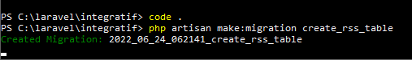
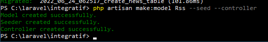
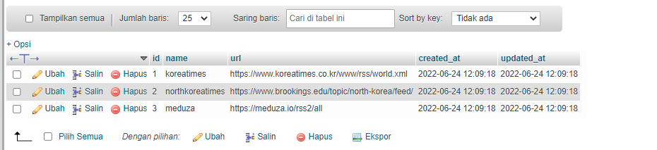
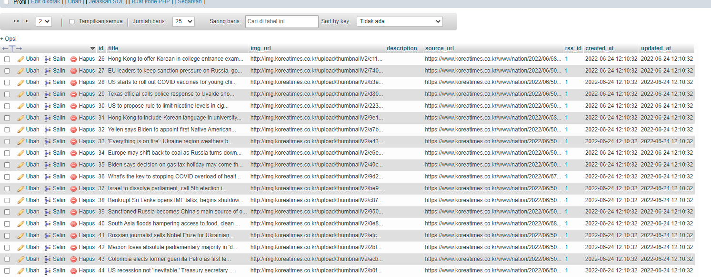
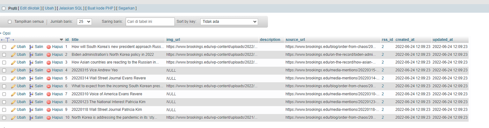
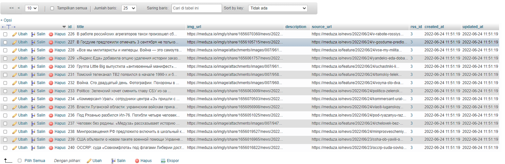

## Final Project - 2
### Bryan Pratama Putra 1202190037

Menghubungkan database dengan mengubah .env


Membuat rss table dan news table
```
php artisan make:migration create_rss_table
php artisan make:migration create_news_table
```



Tambahkan name dan url pada rss table


Tambahkan title,img_url,description,source_url,dan rss_id pada news_table


Membuat model Rss dan News

```
php artisan make:model Rss --seed --controller
php artisan make:model News --controller

```



Melakukan Route di web.php





```
php artisan migrate

```
Edit file NewsController.php


```
php artisan migrate:refresh
php artisan migrate --seed
```

RSS 1




RSS 2




RSS 3



